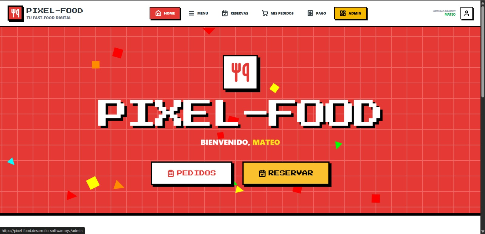

# ¡Hola! Soy  👋
**Quito, Ecuador** 📍
### 🚀 Estudiante de la Carrera de Software | 4to Semestre - UTE
**Quito, Ecuador** 📍

Soy un desarrollador apasionado por construir soluciones robustas y escalables, desde arquitecturas backend complejas hasta interfaces de usuario fluidas. Fuera del código, soy entusiasta del hardware de alto rendimiento y el mundo del motociclismo.

---

## 🛠 Stack Tecnológico

| Categoría | Tecnologías |
| :--- | :--- |
| **Lenguajes** |    |
| **Backend** |    |
| **Frontend** |   |
| **Bases de Datos** |   |
| **QA & DevOps** |    |

---

## 📂 Proyectos Destacados

| Detalle del Proyecto | Vista Previa |
| :--- | :--- |
| **🍕 PIXEL-FOOD**   Sistema integral de menú digital y pedidos para restaurantes.    🛠️ **Tech Stack**: NestJS, React, MongoDB/PostgreSQL.   ✅ **Logro**: Desplegado en producción con Nginx y CI/CD.    🔗 **Código**:   • [Backend (NestJS)](https://github.com/MBacon019/pixel-food-backend)   • [Frontend (React)](https://github.com/MBacon019/pixel-food-frontend) |  |

### 🛠️ Otros Trabajos
*   🧪 **Automatización de QA**: Framework de pruebas de rendimiento y carga con **k6** y **Karate DSL**.
*   🏍️ **Moto_store**: E-commerce especializado en accesorios de motocicletas desarrollado en **Django**.
*   💼 **Digitalización de Negocios**: Modernización de sistemas para **Segundo Bacon Carpintería**.

---

## 📈 Estadísticas y Actividad

  
  

---

## 🔭 Enfoque Actual
*   🔭 **Trabajando en**: Perfeccionamiento de arquitecturas con NestJS y ecosistema Kotlin.
*   🌱 **Aprendiendo**: Patrones de diseño avanzados y optimización de bases de datos a gran escala.
